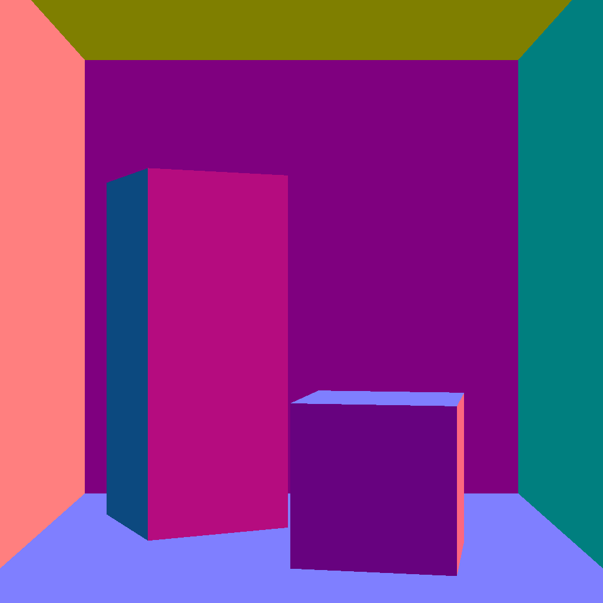
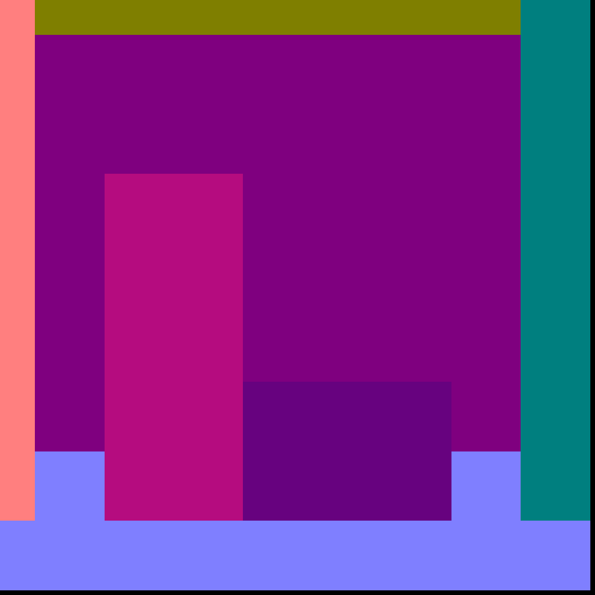
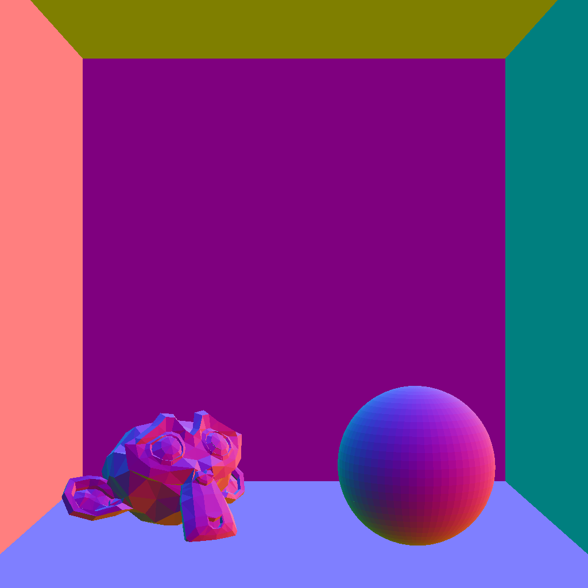
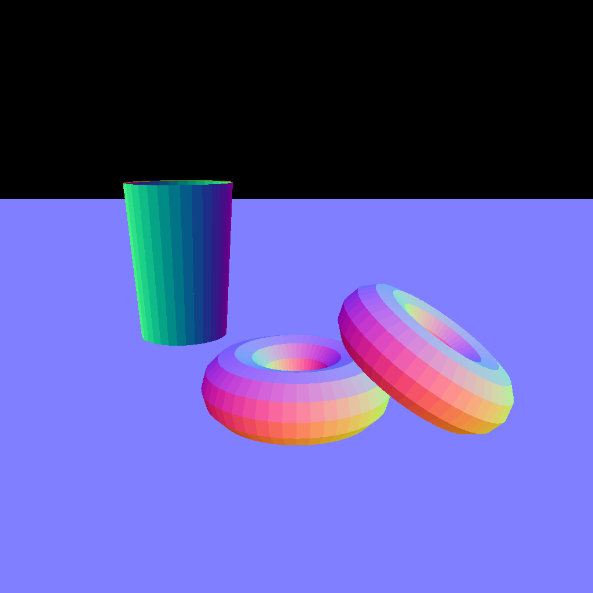
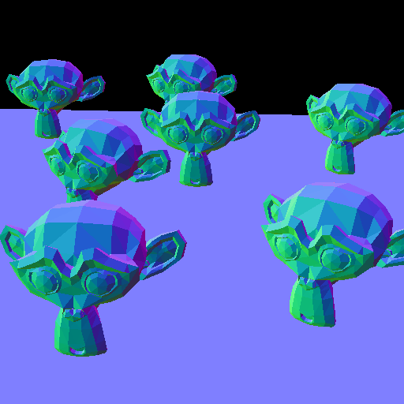

# Computer Graphics
# Samyak Mishra (2022101121)
# Assignment 1 Report

The codebase is in `/simple_renderer/`, without the git files, `.git/` and `extern/`. It contains the code for questions 1 and 2 combined.
The output images for each question are in `images/`, and are linked to here in the report as well.

## How to test
- Add the `extern/` directory to `./simple_renderer/` for the external git repositories.
- Open a terminal into this directory.
- Run `chmod +x test.sh`.
- Run `./test.sh path/to/scenes`, where the CL argument is the path to the scenes repository relative to this directory.

This will rebuild the renderer and run it for each question:
- `correct.json` and `incorrect.json` for Q1, using the BVH on triangles (3) variant.
- Each of the two Cornell Box scenes, the Donuts scene and the TableTop scene, using each intersection variant (0, 1, 2, 3), for Q2.

## Question 1

The cause of the discrepancy is merely type declaration in the file
`vec.h`. At lines 165 and 167, we find the following `typedef`s.
```cpp
        typedef Vector2<float> Vector2f;
        typedef Vector3<float> Vector3f;
```
The type of the vectors here is the core issue, i.e. `float`. The reason
is that floating point numbers are stored as 3 parts: sign, mantissa and
exponent. For smaller numbers this representation is precise enough, but
as the magnitude of a number (strictly speaking, the number of
significant digits in the number, and magnitude is proportional to
number of digits) increases, the precision with which the floating point
data type represents it decreases. And for the `float` datatype in
C/C++, which typically stores 4B of data, this imprecision appears
around numbers of magnitude `1e6`. And since the displacement of the
scene from `correct.png` to `incorrect.json` is 1,000,000 units, the locations
of all points, stored as `Vector3f`s, are imprecise, thus leading to the
incorrectly rendered image.\
\
Now let us look at why `incorrect.png` looks the way it does. If we
observe, the objects appear somewhat (not exactly) orthographic, i.e. not
in the correct perspective. Moreover, each object has the same shade.
Since colour here is assigned based on the normals at a point and its
intersection with the rays shot from the camera, this indicates that for all points
on an object the oncoming ray is the same. This can be confirmed if we go
to the `generateRay()` function in `camera.cpp`. Here, the direction
vector of the ray is defined as the normalisation of the vector
`(pixelCenter - this->from)`. And since, both are stored as `Vector3f`s,
the float imprecision causes this direction vector to be stored as the
same for each object (we can verify by printing it to the terminal),
thus generating the same ray (since the origin vector is `this->from`
anyway) for all points on an object. Then the ray intersects the same
point on the object for all its points and thus the same normals and
thus the same colours are assigned to all the object's front-facing
points. Hence the slightly orthographic look.\
\
To fix the issue, simply increase precision! Replace the `float` with
`double` (8B, so more precision).
```cpp
        typedef Vector2<double> Vector2f;
        typedef Vector3<double> Vector3f;
```

This makes the direction vector more precise and hence different (and
accurate) for each point, resulting in the accurate rendering of the
scene (except for that weird inexplicable yellow line that pops up by
the longer box, probably because the whole scene appears sort of
shifted, maybe because the camera was accidentally slightly rotated
while designing the model).

The images are attached below.


The output of `correct.json`.


The output of `incorrect.json`, before changing the datatype.


The output of `incorrect.json`, after changing the datatype.

## Question 2

The timings to render the scene vary from run to run, and are
indicative. The relative order has been observed to be consistent
though, as follows:


**Naive $>$ AABB (2.1) $\approx$ BVH on AABB (2.2) $>$ BVH on Triangles
(2.3)**

The Naive approach, being the $\mathcal{O}(n)$ approach, is the slowest,
and BVH on Triangles, having the most hierarchical organisation right
from scene level to triangle level (via a two-level BVH), is the fastest
as it is the $\mathcal{O}(\verb|log|_2(n))$ approach (where $n$ is the
number of triangles in the scene). Basic AABB and BVH on AABB fall
between these two, as they are not fully optimised, but we notice that
BVH on AABB *can be* slightly (within a second or so) slower than basic
AABB. This is probably because even though we were doing linear search
on AABBs in the prior method and a binary (tree) search (via BVH) on
them in the latter, the extra computations involved for the BVH itself
may have been **relatively** significant. Do note that the render times 
vary from run to run, so the order may keep changing between basic AABB
and BVH on AABB; all that is significant here is that they both have the
same approximate render times, as they operate on the same number of
triangles (BVH on AABB only optimises on surfaces/objects not triangles).
As the number of surfaces(objects) increases, we will observe that BVH on
AABB performs better than basic AABB (also note that big-O notation denotes 
the *limit*, so the inequality holds for large values of input), as can be
seen in the TableTop example.

### Cornell Box (Hi Poly)

The timings for the various interaction variants are:

1.  Naive intersection: 187272.937500 ms

2.  AABB intersections: 15344.780273 ms

3.  BVH on AABB: 15838.872070 ms

4.  BVH on Triangles: 513.312988 ms


_Naive_

_Basic AABB_

_BVH on AABB_

_BVH on Triangles_

### Cornell Box (Lo Poly)

The timings for the various interaction variants are:

1.  Naive intersection: 38276.378906 ms

2.  AABB intersections: 3646.281982 ms

3.  BVH on AABB: 3780.935059 ms

4.  BVH on Triangles: 449.028992 ms


_Naive_

_Basic AABB_

_BVH on AABB_

_BVH on Triangles_

### Donuts

The timings for the various interaction variants are:

1.  Naive intersection: 48103.218750 ms

2.  AABB intersections: 5007.029785 ms

3.  BVH on AABB: 5022.017090 ms

4.  BVH on Triangles: 621.659973 ms


_Naive_

_Basic AABB_

_BVH on AABB_

_BVH on Triangles_

### ~~Monke~~ TableTop

The timings for the various interaction variants are:

1.  Naive intersection: 54597.265625 ms

2.  AABB intersections: 4160.033203 ms

3.  BVH on AABB: 4017.016113 ms

4.  BVH on Triangles: 212.319000 ms

  

_Naive_
  

_Basic AABB_
  

_BVH on AABB_
  

_BVH on Triangles_
