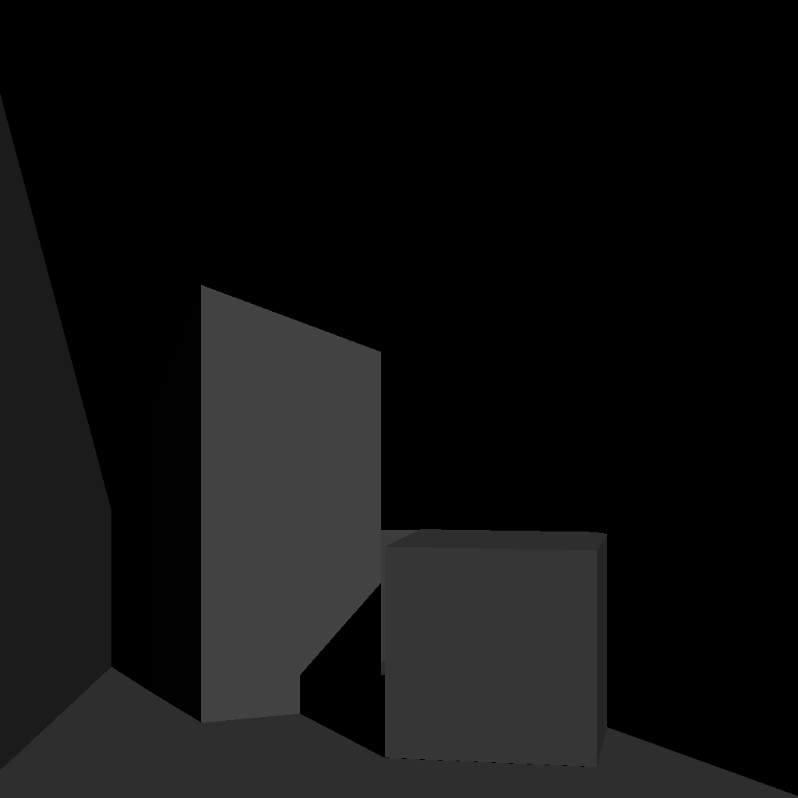
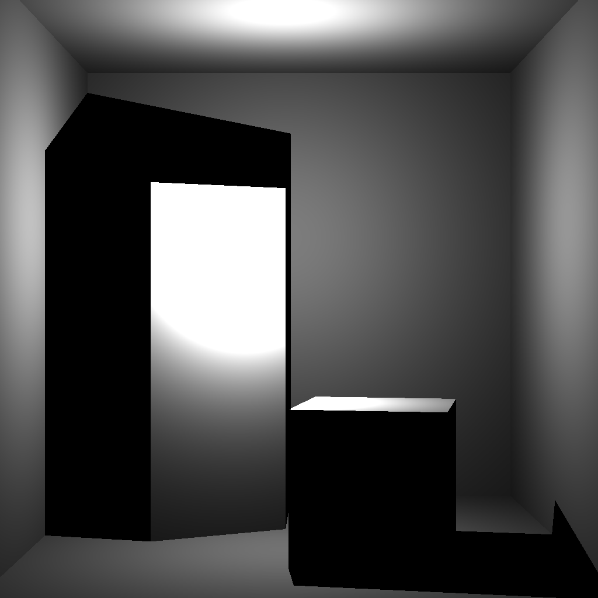
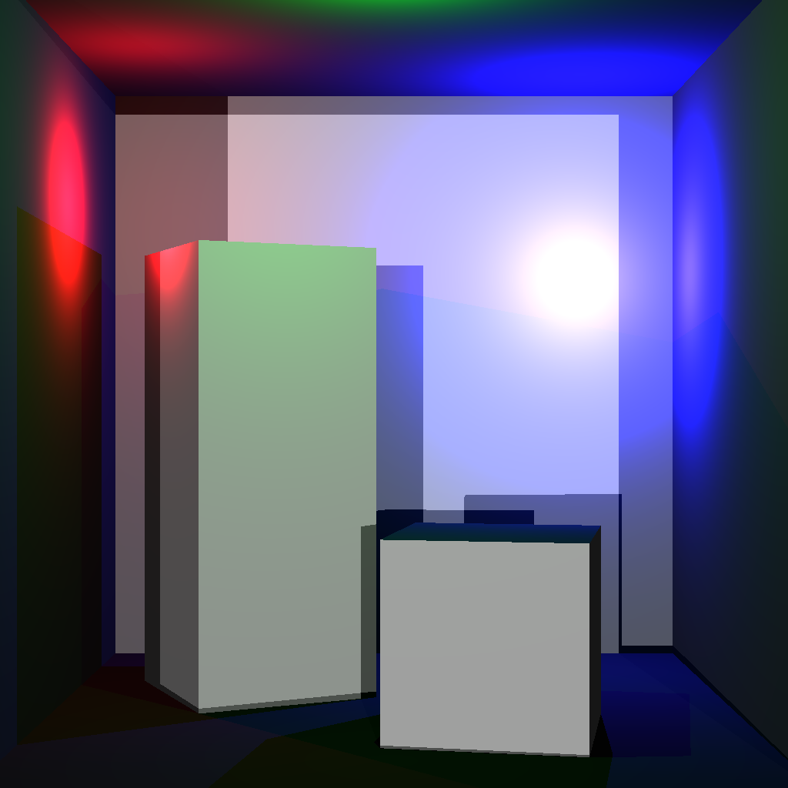
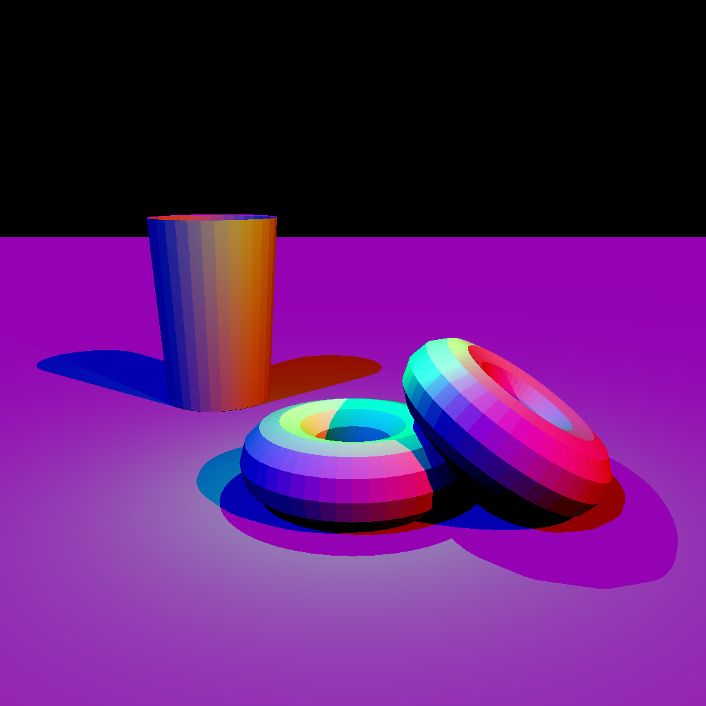
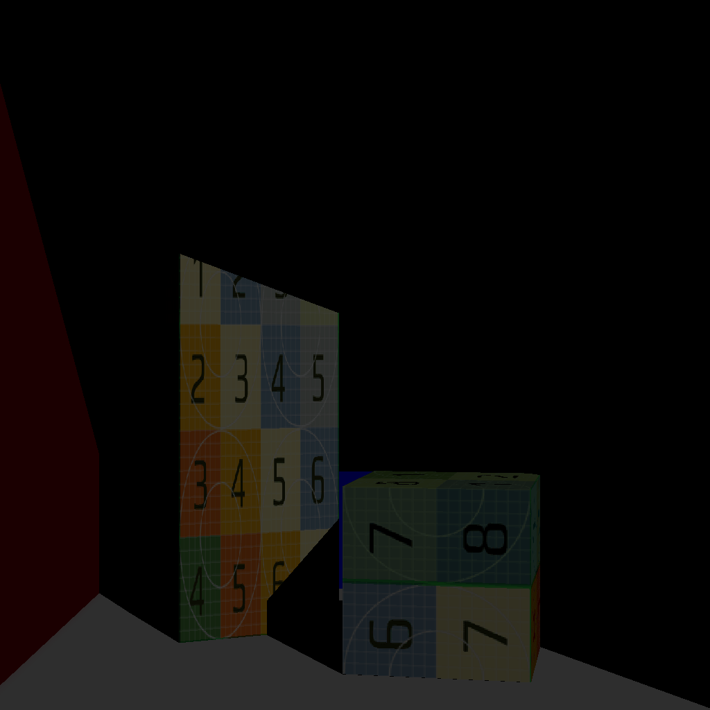
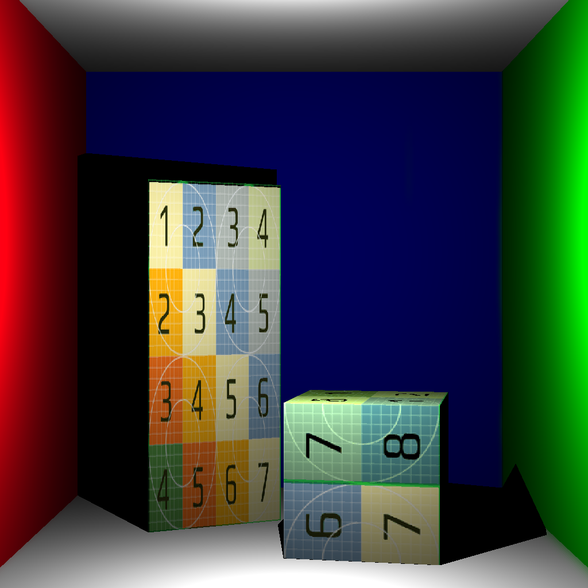
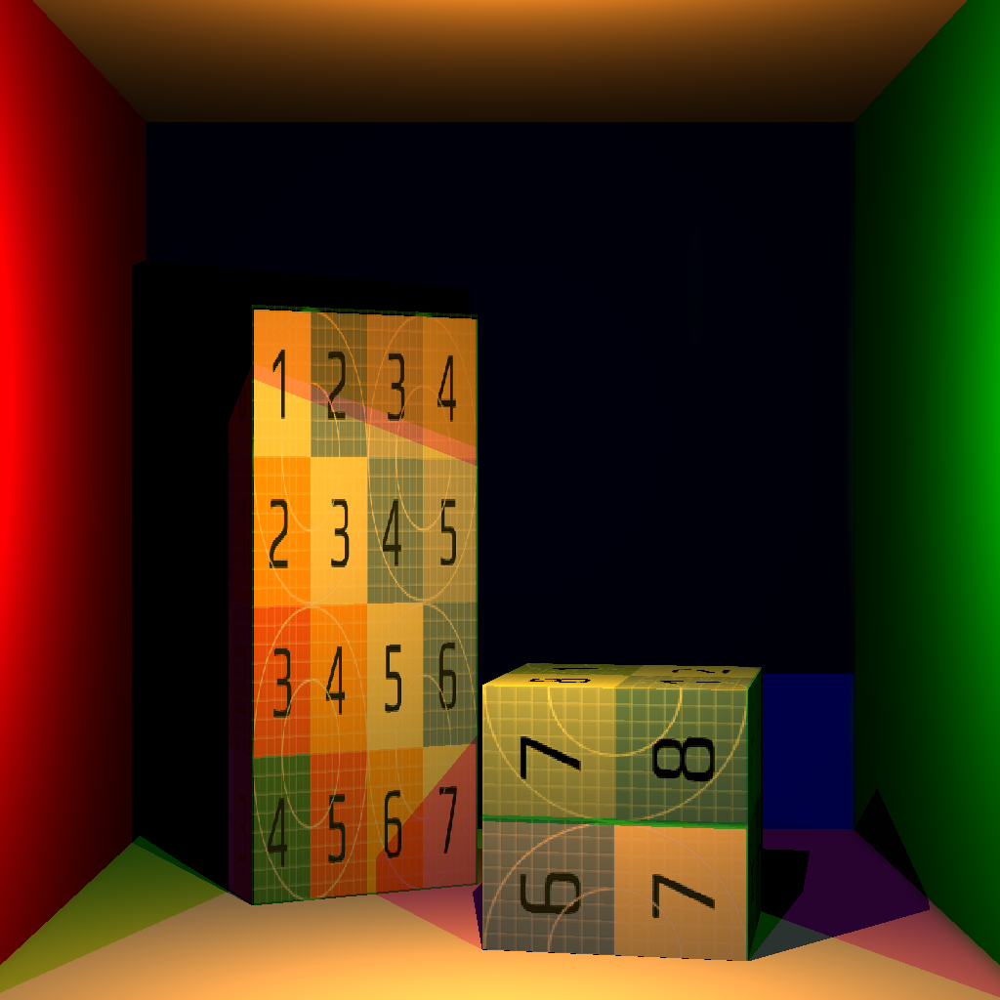
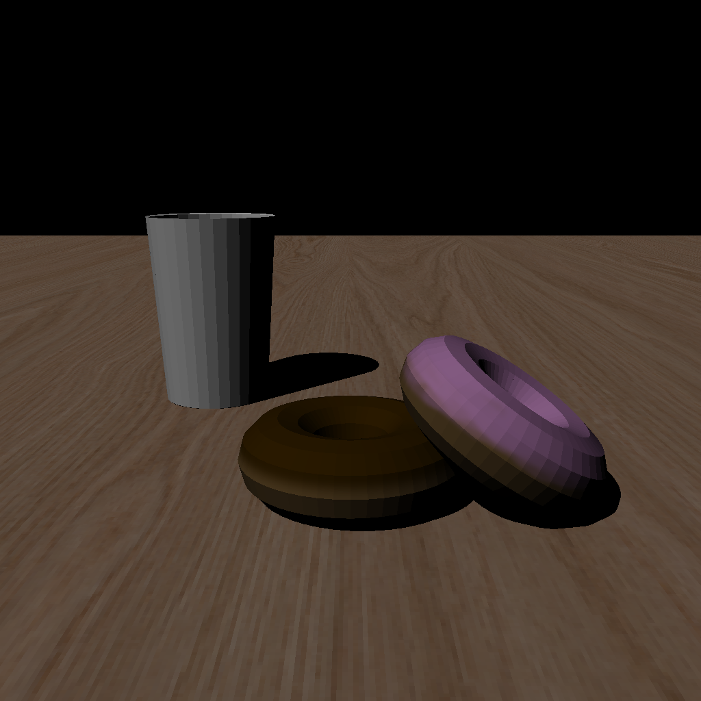
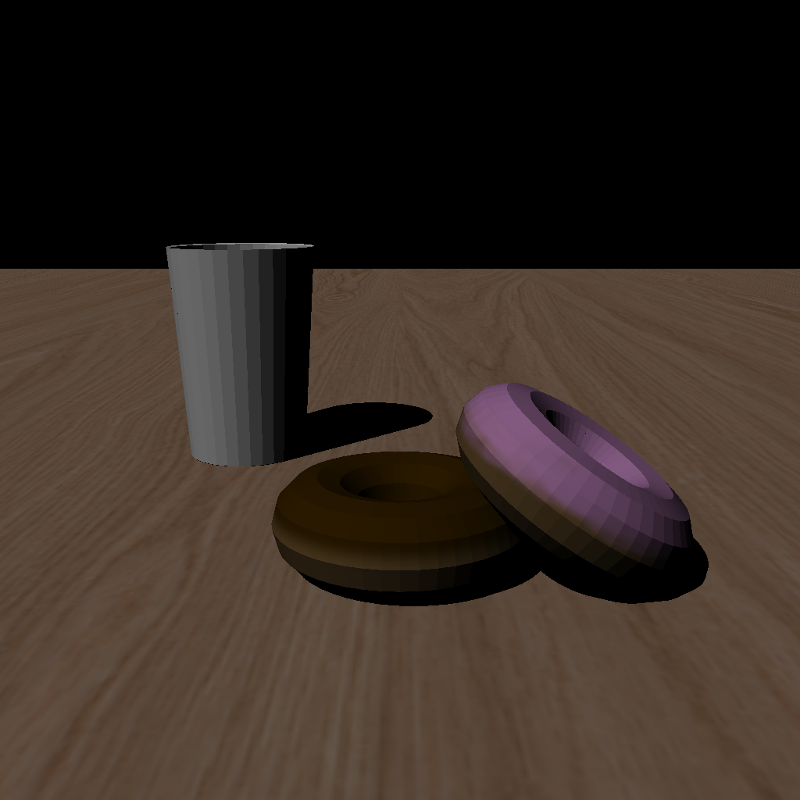
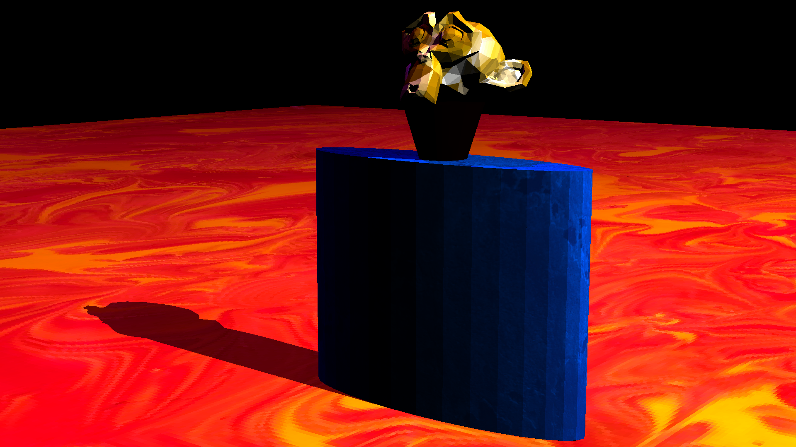

# Computer Graphics
# Samyak Mishra (2022101121)
# Assignment 2 Report

The codebase is in `/simple_renderer/`, without the git files, `.git/` and `extern/`. It contains the code for questions 1 and 2 combined.
The output images for each question are in `images/`, and are linked to here in the report as well. The files for the scene that I created are in `/myscene/`

## How to test
- Add the `extern/` directory to `./simple_renderer/` for the external git repositories.
- Open a terminal into this directory.
- Run `chmod +x test.sh`.
- Run `./test.sh path/to/scenes`, where the CL argument is the path to the scenes repository relative to this directory.

This will rebuild the renderer and run it for each question:
- For Q1, each of the three lighting variants of the Cornell box scene, and the Donuts scene, each with the Nearest Neighbour variant (0).
- For Q2, each of the three lighting variants of the Cornell box scene, and the Donuts scene, each with both the Nearest Neighbour (0) and the Bilinear (1) Interpolation variants.
- For my own scene, both the Nearest Neighbour (0) and the Bilinear (1) Interpolation variants.

Note:
- the `images/` directory is not initially attached in the zip file, but will get generated along with the images in it.
- For some scenes (like the donuts), I was getting some whitish cracks along the shadow regions. I was able to fix it, with some help from Aakash KT, by checking if the cosine of the angle between the normal (at the point in consideration) and the shadow ray's direction is negative, which essentially checks if the shadow ray goes inside the surface. If so, I simply ignore the contribution of the ray towards the coloring. I had referred to slides 22 and 23 of this lecture for this :  https://my.eng.utah.edu/~cs6958/slides/Lec5.pdf .

The output images for the given scenes along with their render times are as follows:

## Question 1

### Cornell Box

**Directional Light**

Render Time: 809.835999 ms

**Point Light**

Render Time: 893.948975 ms

**Multiple Lights**

Render Time: 2508.448975 ms

### Donuts

Render Time: 2363.143066 ms

## Question 2

### Cornell Box

**Directional Light**

*Nearest Neighbour Interpolation*

Render Time: 809.661987 ms

*Bilinear Interpolation*

Render Time: 826.685974 ms

**Point Light**

*Nearest Neighbour Interpolation*

Render Time: 815.966980 ms

*Bilinear Interpolation*

Render Time: 842.831970 ms

**Multiple Lights**

*Nearest Neighbour Interpolation*

Render Time: 1540.873047 ms

*Bilinear Interpolation*

Render Time: 1557.225952 ms

### Donuts
*Nearest Neighbour Interpolation*

Render Time: 1778.883057 ms

*Bilinear Interpolation*

Render Time: 1756.105957 ms

## My Scene

I made a scene in Blender involving a two distorted cylinders, a plane and Suzanne the monkey. I added textures to the plane, the bottle (deformed cylinder) and the monkey.

Because I couldn't find any free-to-use textures, I cite the sources of these textures:
- /myscene/textures/yellow-diamond.png   : <a href="https://www.freepik.com/free-photo/gold-polygon-abstract-design_11306682.htm#query=diamond%20textures&position=31&from_view=search&track=ais&uuid=194b3e10-de04-4c35-b00f-9964a3e11af3">Image by rawpixel.com</a> on Freepik
- /myscene/textures/blue3.png   : <a href="https://www.freepik.com/free-photo/blue-absract-detailed-texture_6241984.htm#query=blue%20stone&position=47&from_view=search&track=ais&uuid=16c03b6d-6fe1-4c54-81ee-bc5e69fd6e70">Image by starline</a> on Freepik
- /myscene/textures/lava.png : Image by <a href="https://www.freepik.com/free-photo/still-life-with-psychedelic-colored-background_30997078.htm#query=lava&position=3&from_view=search&track=sph&uuid=f9bd2db0-c0e7-4050-b98e-6e7d6f137f55">Freepik</a>

Note the increased smoothness in the bilinear interpolation output as compared to the nearest neighbour interpolation one.

*Nearest Neighbour Interpolation*

Render Time: 3516.882080 ms

*Bilinear Interpolation*

Render Time: 3486.904053 ms

